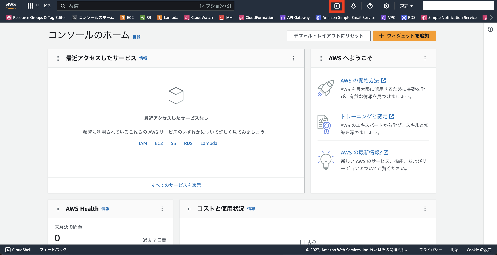
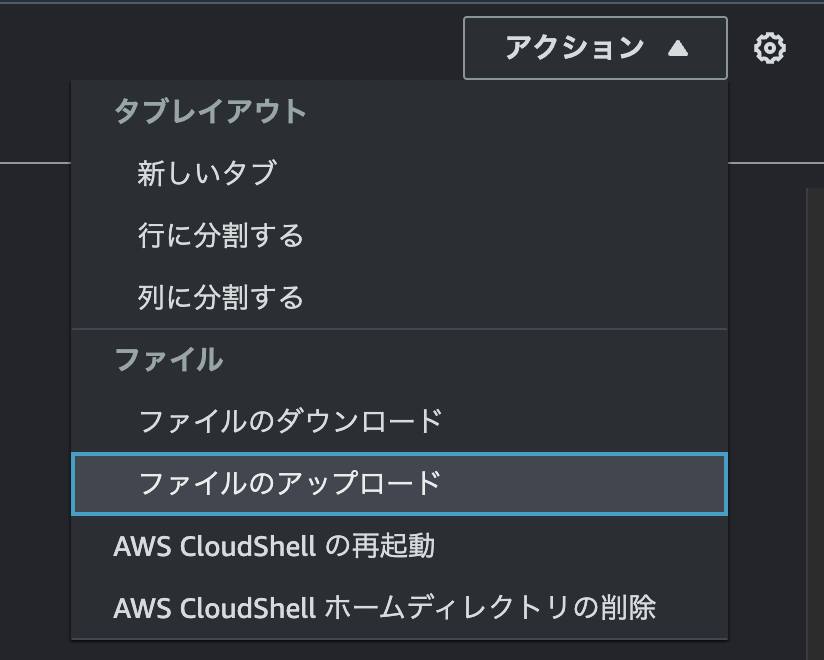

# 作業環境構築

AWS環境を構築するための環境を構築します。<br>
と言っても本勉強会ではAWSマネジメントコンソールもしくは[AWS CloudShell](https://docs.aws.amazon.com/ja_jp/cloudshell/latest/userguide/welcome.html)にて環境を構築していくため、特に使用PCにコマンドインストール等の対応は不要です。

AWSマネジメントコンソールのログイン手順について解説していきます。

## AWSマネジメントコンソール ログイン手順
（いつでも出せるようにして欲しいため、ブラウザ検索手順から解説していきます）

アカウント情報はこちらを参照してください。

[//]: # (TODO: アカウント情報のリンクを記載)

1. ブラウザにて、「AWSマネジメントコンソール」と検索
2. 検索にて出てきたAWSマネジメントコンソール画面から「コンソールにサインイン」ボタンをクリック
3. サインイン画面から「IAMユーザー」を選択し、アカウントIDをアカウント情報を参照・入力して次へをクリック
4. アカウント情報からアカウント情報を入手し、入力しサインインをクリック
5. サインインができたことを確認

## CloudShellの開き方確認

1. 以下ボタンをクリック（もしくは検索窓で「CloudShell」と検索）してCloudShellを開く
   
2. CloudShellが立ち上がったことを確認する
3. 右上xをクリックし、CloudShellを閉じる

## 踏み台サーバログイン手順
cloud shellを開きます。

踏み台サーバの秘密鍵をcloud shell環境にアップロードします。
1. 右上のアクションからファイルのアップロードを選択
1. 事前に受け取った踏み台サーバの秘密鍵を選択し、アップロード



次に、[EC2インスタンス一覧画面](https://ap-northeast-1.console.aws.amazon.com/ec2/home?region=ap-northeast-1#Instances:v=3;$case=tags:true%5C,client:false;$regex=tags:false%5C,client:false)から踏み台サーバの詳細画面に飛び、踏み台サーバ(edu-foodmemo-bastion01)のパブリックIPアドレスをコピーします。

以下コマンドを実行し、踏み台サーバ(edu-foodmemo-bastion01)にログインします。
```
# 秘密鍵の権限修正(こちらをやらなければssh実施時コマンドエラーになる)
chmod 400 ./edu-foodmemo-bastion.pem

# sshログイン
BASTION_IP="踏み台サーバ(edu-foodmemo-bastion01)のパブリックIPアドレス"
ssh -i ./edu-foodmemo-bastion.pem ec2-user@${BASTION_IP}
-> 初めてログインの場合はフィンガープリント確認が表示されるため、yesと入力
-> 踏み台サーバにログインできたことを確認
```
