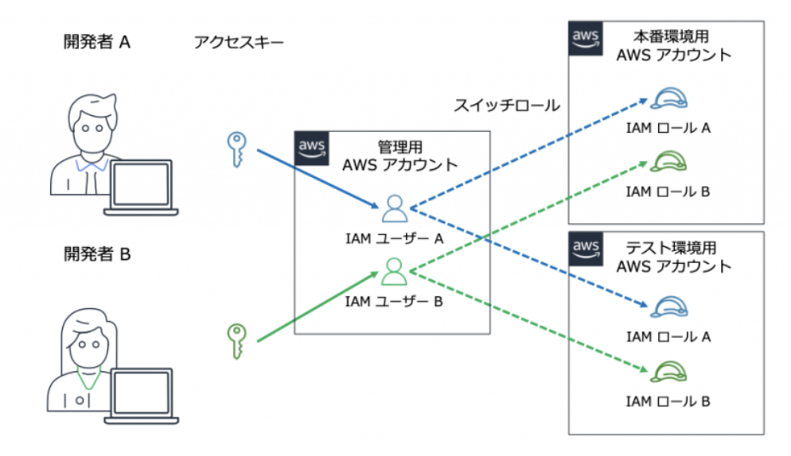

# IAMについて
AWS Identity and Access Management (IAM) は、AWSリソースへのアクセス許可を一元管理をするためのサービスのこと。

認証は
- ユーザ
- グループ
- ロール

を利用することで細かいアクセス制御を実現する。

メンバーが適切な権限でシステムにアクセスできるための、情報セキュリティの基盤となる概念。

詳細は[こちら](https://aws.amazon.com/jp/iam/)を参照のこと

