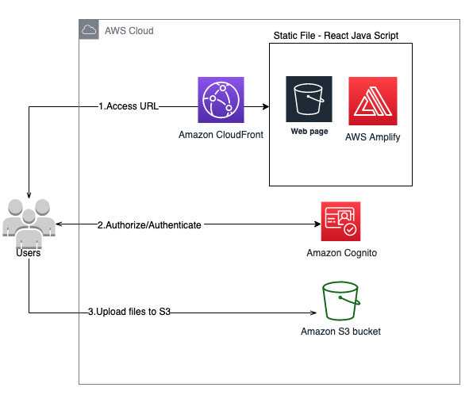

# S3について
Amazon Simple Storage Service (Amazon S3) とは、Amazonが提供するデータストレージサービスのこと。

ウェブサイトやアプリケーションなどのデータバックアップおよび復元、アーカイブなど、さまざまなことに利用される。

動画・画像ファイルやCSSなどWebで使う静的なファイルをS3に置いて配信するなどの用途にも利用される。

以下がS3のメリット。
- 高い可用性や耐久性
  - 利用するストレージリソースを自由にスケールアップ・ダウンすることができる。また、自動的にデータセンターに複製し障害やエラーなどからデータを保護することができる。
- コストを意識した利用が可能な従量課金制
  - 従量課金制で、「ストレージ容量」「リクエスト数」「データ転送量」といった使用量に応じて料金が算出されるため、コストを意識した利用が可能となる。
- 容量無制限
  - 格納可能なデータの総量とオブジェクトの数には制限が無く、データをいくらでもアップロードできる。（1PUTには容量制限あり（5GB））

