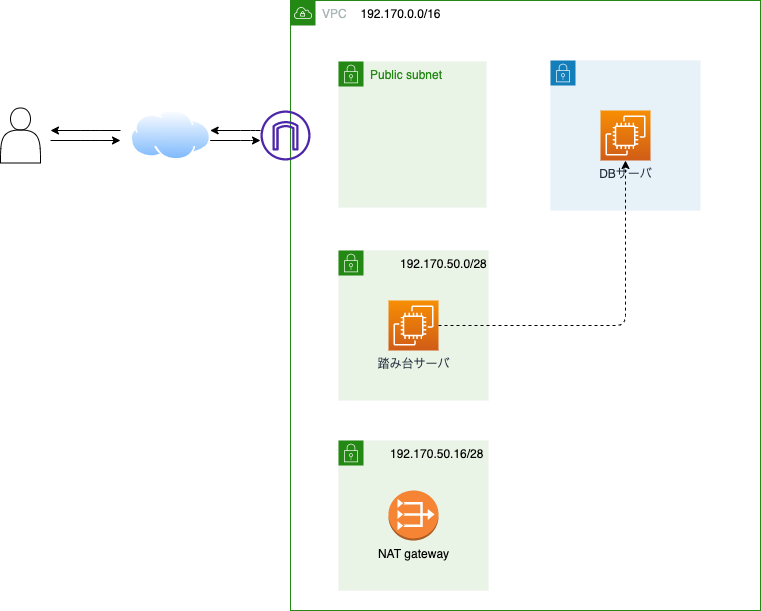
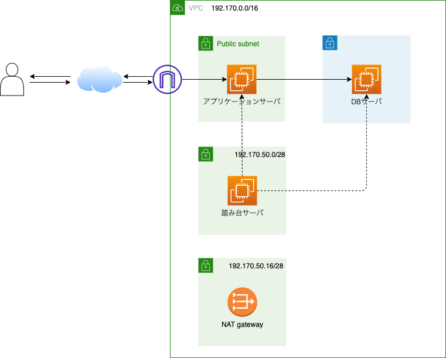
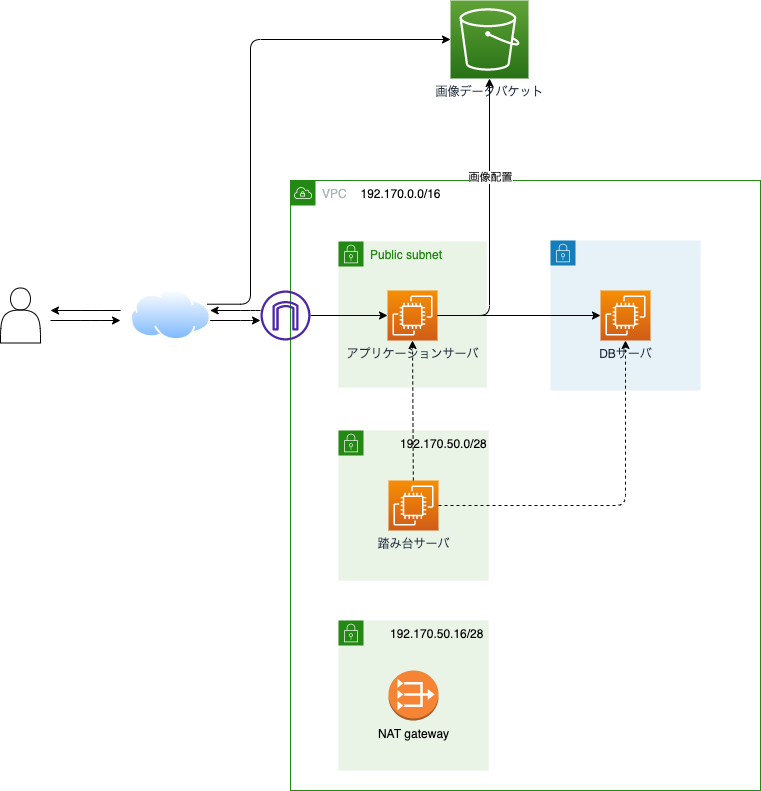

# ウェブサイト環境構築

## 基本ネットワーク構築
以下のように、パブリックサブネット・プライベートサブネットを一つずつ作成していきます。<br>


### サブネット作成手順
1. 検索窓に「VPC」と入力、検索結果の「VPC」を選択してVPC画面を表示<br>

1. 左ペインから「Subnets」を選択
1. 右上の「サブネットを作成」ボタンをクリック
1. [AWS勉強会 設定項目一覧(3章)](https://docs.google.com/spreadsheets/d/1rGtw8drecGv352dEZplBKfBngov2kCl3961_kmPJUbM/edit?usp=sharing)の「サブネット一覧」シートを参照し、自分担当の以下を設定
    - アプリケーションサブネット
    - DBサブネット
1. 設定後、サブネットを作成ボタンをクリックし、作成成功を確認する。<br>


### ルーティング設定
1. 左ペインから「Route tables」を選択
1. アプリケーションサブネットのルーティング設定
    1. ルートテーブル画面から、右上の「ルートテーブル作成」ボタンをクリック
    1. [AWS勉強会 設定項目一覧(3章)](https://docs.google.com/spreadsheets/d/1rGtw8drecGv352dEZplBKfBngov2kCl3961_kmPJUbM/edit?usp=sharing)の「ルートテーブル一覧」シートを参照し、自分担当のアプリケーションルートテーブルを設定<br>
    
    1. 設定項目の入力が完了したら、「ルートテーブルを作成」ボタンをクリックし、正常作成を確認<br>
    
    1. ルートテーブル詳細画面 > ルートタブから、ルートを編集をクリック<br>
    
        1. [AWS勉強会 設定項目一覧(3章)](https://docs.google.com/spreadsheets/d/1rGtw8drecGv352dEZplBKfBngov2kCl3961_kmPJUbM/edit?usp=sharing)の「ルート一覧」シートを参照し、アプリケーションルートテーブルのルート一覧を設定する
        1. 変更を保存をクリックし、正常保存を確認する<br>
        
    1. ルートテーブル詳細画面 > サブネットの関連付けタブから、サブネットの関連付けを編集をクリック<br>
    
        1. [AWS勉強会 設定項目一覧(3章)](https://docs.google.com/spreadsheets/d/1rGtw8drecGv352dEZplBKfBngov2kCl3961_kmPJUbM/edit?usp=sharing)の「ルートテーブル一覧」シートの関連付けサブネットを参照し、設定する
        1. 変更を保存をクリックし、正常保存を確認する<br>
        
1. DBサブネットのルーティング設定
    1. 「アプリケーションサブネットのルーティング設定」手順を、アプリケーションルートテーブルに読み替えて設定する


## DBサーバの立ち上げ

### 作成後ネットワーク構成図イメージ


### セキュリティグループの作成
1. 検索窓に「EC2」と入力、検索結果の「EC2」を選択してEC2画面を表示<br>

1. 左ペインから「Security Groups」を選択
1. セキュリティグループを作成
    1. 右上の「セキュリティグループを作成」ボタンをクリック
    1. [AWS勉強会 設定項目一覧(3章)](https://docs.google.com/spreadsheets/d/1rGtw8drecGv352dEZplBKfBngov2kCl3961_kmPJUbM/edit?usp=sharing)の「セキュリティグループ一覧」シートを参照し、自分担当のDBサーバ用セキュリティグループを設定
    1. 設定項目の入力が完了したら、「セキュリティグループを作成」ボタンをクリックし、正常起動を確認

### EC2の作成
1. 左ペインから「インスタンス」を選択
1. 右上の「インスタンスを起動」ボタンをクリック
1. インスタンスを起動画面
    1. [AWS勉強会 設定項目一覧(3章)](https://docs.google.com/spreadsheets/d/1rGtw8drecGv352dEZplBKfBngov2kCl3961_kmPJUbM/edit?usp=sharing)の「EC2インスタンス一覧」シートのDBサーバ欄を参照し、自分担当の項目で設定<br>
    
    1. 設定項目の入力が完了したら、「インスタンスを起動」ボタンをクリックし、正常起動を確認

### 各種インストール

#### 事前準備
[踏み台サーバログイン手順](../0%E7%AB%A0/%E4%BD%9C%E6%A5%AD%E7%92%B0%E5%A2%83%E6%A7%8B%E7%AF%89)を参照し、踏み台サーバへログインします。

#### DBサーバログイン
[EC2インスタンス一覧画面](https://ap-northeast-1.console.aws.amazon.com/ec2/home?region=ap-northeast-1#Instances:v=3;$case=tags:true%5C,client:false;$regex=tags:false%5C,client:false)から自分担当のDBサーバの詳細画面に飛び、IPアドレスをコピーします。
以下コマンドを踏み台サーバ内で実行します。
```
DB_IP="DBサーバのIPアドレス"
ssh -i ./edu-foodmemo.pem ec2-user@${DB_IP}
-> 初めてログインの場合はフィンガープリント確認が表示されるため、yesと入力
-> DBサーバにログインできたことを確認
```

#### MySQL環境構築
mysqldをインストールします。
```
# mysqlリポジトリをインストール(これをやらなければインストールできない)
sudo dnf -y localinstall  https://dev.mysql.com/get/mysql80-community-release-el9-1.noarch.rpm

# mysql serverのインストール
sudo dnf install mysql-community-server -y

# mysqlインストール確認
dnf list installed | grep mysql
-> mysql系のライブラリ一覧が出力されること
```


インストール完了後、以下を実行しmysqlサーバを立ち上げます。
```
# mysqlサーバの起動
sudo systemctl start mysqld

# mysqlサーバのステータス確認
systemctl status mysqld
-> active(running)と表示されること

# 自動起動を有効にする
sudo systemctl enable mysqld; echo $?
-> 0と返ってくること
```

mysqlサーバの初期設定を行います。
```
# mysql server初期パスワード
sudo grep -e "\[Server\] A temporary password is generated for root@localhost:" /var/log/mysqld.log
-> 以下のような形式で、初期パスワードを含んで出力されるので、初期パスワードをコピーする
[Server] A temporary password is generated for root@localhost: ****初期パスワード*****

# mysqlログイン
mysql -uroot -h 127.0.0.1 -p
-> 上記で取得できたパスワードを入力

# パスワード変更
ALTER USER 'root'@'localhost' IDENTIFIED BY 'q9XX2yyu+';

# food_memoデータベース作成
CREATE DATABASE food_memo;

# food_memoユーザを作成
CREATE USER food_memo IDENTIFIED BY 'q9XX2yyu+';

# food_memoユーザにfood_memoデータベースの権限付与
GRANT ALL ON food_memo.* TO food_memo;

# mysqlログアウト
exit
```


## アプリケーションサーバの立ち上げ

### 作成後ネットワーク構成図イメージ


### セキュリティグループの作成
1. 検索窓に「EC2」と入力、検索結果の「EC2」を選択してEC2画面を表示<br>

1. 左ペインから「Security Groups」を選択
1. セキュリティグループを作成
    1. 右上の「セキュリティグループを作成」ボタンをクリック
    1. [AWS勉強会 設定項目一覧(3章)](https://docs.google.com/spreadsheets/d/1rGtw8drecGv352dEZplBKfBngov2kCl3961_kmPJUbM/edit?usp=sharing)の「セキュリティグループ一覧」シートを参照し、自分担当のDBサーバ用セキュリティグループを設定
    1. 設定項目の入力が完了したら、「セキュリティグループを作成」ボタンをクリックし、正常起動を確認

### EC2の作成
1. 検索窓に「EC2」と入力、検索結果の「EC2」を選択してEC2画面を表示<br>

1. 左ペインから「インスタンス」を選択
1. 右上の「インスタンスを起動」ボタンをクリック
1. インスタンスを起動画面
    1. [AWS勉強会 設定項目一覧(3章)](https://docs.google.com/spreadsheets/d/1rGtw8drecGv352dEZplBKfBngov2kCl3961_kmPJUbM/edit?usp=sharing)の「EC2インスタンス一覧」シートのアプリケーションサーバ欄を参照し、自分担当の項目で設定<br>
    
    1. 設定項目の入力が完了したら、「インスタンスを起動」ボタンをクリックし、正常起動を確認

### 各種インストール

#### 事前準備
[踏み台サーバログイン手順](../0%E7%AB%A0/%E4%BD%9C%E6%A5%AD%E7%92%B0%E5%A2%83%E6%A7%8B%E7%AF%89)を参照し、踏み台サーバへログインします。

#### アプリケーションサーバログイン
[EC2インスタンス一覧画面](https://ap-northeast-1.console.aws.amazon.com/ec2/home?region=ap-northeast-1#Instances:v=3;$case=tags:true%5C,client:false;$regex=tags:false%5C,client:false)から自分担当のアプリケーションサーバの詳細画面に飛び、IPアドレスをコピーします。
以下コマンドを踏み台サーバ内で実行します。
```
APP_IP="アプリケーションサーバのIPアドレス"
ssh -i ./edu-foodmemo.pem ec2-user@${APP_IP}
-> 初めてログインの場合はフィンガープリント確認が表示されるため、yesと入力
-> アプリケーションサーバにログインできたことを確認
```

#### apache環境構築
httpd（apache）をインストールします。<br>
バックグラウンドプロセスとしてアプリケーションサーバ内に常駐させ、httpリクエストを受けられるようにします。
```
# httpdのインストール
sudo dnf install httpd -y

# httpdインストール確認
dnf list installed | grep httpd
-> httpd系のライブラリ一覧が出力されること
```

インストール完了後、httpd設定ファイルに以下設定を加え、80ポートで受けた全てのhttpリクエストをlocalで立ち上がっているhttp://localhost:8080に向ける設定を行います。（リバースプロキシ設定）
```
echo | sudo tee -a /etc/httpd/conf/httpd.conf
echo "ProxyPass        / http://localhost:8080/" | sudo tee -a /etc/httpd/conf/httpd.conf
echo "ProxyPassReverse / http://localhost:8080/" | sudo tee -a /etc/httpd/conf/httpd.conf

# 設定反映確認
grep "ProxyPass        / http://localhost:8080/" /etc/httpd/conf/httpd.conf
grep "ProxyPassReverse / http://localhost:8080/" /etc/httpd/conf/httpd.conf
-> 出力されること
```

以下を実行し、httpdサービスを立ち上げます。
```
# httpサーバの起動
sudo systemctl start httpd

# httpサーバの起動確認
systemctl status httpd
-> active(running)と表示されること

# 自動起動を有効にする
sudo systemctl enable httpd; echo $?
-> 0と返ってくること
```

### DB接続確認
まず、mysql-cliをインストールします。
```
# mysqlリポジトリのインストール
sudo dnf -y localinstall  https://dev.mysql.com/get/mysql80-community-release-el9-1.noarch.rpm

# mysql clientのインストール
sudo dnf install -y mysql-community-client

# コマンドインストール確認
which mysql
-> 「/usr/bin/mysql」と返ってくること
```

次に、[インスタンス一覧ページ](https://ap-northeast-1.console.aws.amazon.com/ec2/home?region=ap-northeast-1#Instances:v=3;$case=tags:true%5C,client:false;$regex=tags:false%5C,client:false)にアクセスします。<br>
自分担当のDBインスタンスの詳細画面にアクセスし、プライベートIPv4アドレスをコピーします。<br>
以下コマンドを実行し、アプリケーションサーバ -> DBサーバの接続確認を実施します。
```
DB_HOST="DBサーバのIPアドレス"
DB_PASSWORD=q9XX2yyu+
mysql -h ${DB_HOST} -u food_memo -D food_memo -p${DB_PASSWORD}
-> 正常にログインでき「mysql>」プロンプトが表示されること
-> ログインできない場合は、セキュリティグループ・ルートテーブル・DBユーザ設定などが怪しいです
```

## S3の作成

### 作成後ネットワーク構成図イメージ


### S3バケットの作成
1. 検索窓に「VPC」と入力、検索結果の「VPC」を選択してS3画面を表示<br>

1. 左ペインから「バケット」を選択
1. バケット作成
        1. 「バケットを作成」ボタンをクリック
    1. [AWS勉強会 設定項目一覧(3章)](https://docs.google.com/spreadsheets/d/1rGtw8drecGv352dEZplBKfBngov2kCl3961_kmPJUbM/edit?usp=sharing)の「S3バケット一覧」シートを参照し、自分担当分を設定
    1. 設定後、「バケットを作成」ボタンをクリック
1. バケットポリシーの設定
    1. バケット一覧画面から、作成したバケットをクリックしてバケット詳細画面を表示する
    1. アクセス許可タブをクリックする<br>
    
    1. バケットポリシーセクションから編集ボタンをクリックし、バケットポリシー編集画面を表示する
    1. 以下バケットポリシーを貼り付ける<br>
    ※(バケット名)に作成したバケット名を設定
    ```
    {
        "Version": "2012-10-17",
        "Statement": [
            {
            "Effect": "Allow",
            "Principal": "*",
            "Action": [
                "s3:GetObject"
            ],
            "Resource": "arn:aws:s3:::(バケット名)/food_memo/*"
            }
        ]
    }
    ```

### ウェブサイト -> S3バケットへのアクセス権限付与

#### ポリシーの作成
1. 検索窓に「IAM」と入力、検索結果の「IAM」を選択してIAM画面を表示<br>

1. 左ペインから「ポリシー」を選択
1. 「ポリシーの作成」ボタンをクリック
1. ポリシーエディタをJSON形式で開き、以下を貼り付け次へをクリック
    - オブジェクトの配置・取得・削除権限付与
    - バケット一覧取得権限付与
    ```
    {
        "Version": "2012-10-17",
        "Statement": [
            {
                "Sid": "VisualEditor0",
                "Effect": "Allow",
                "Action": [
                    "s3:PutObject",
                    "s3:GetObject",
                    "s3:DeleteObject"
                ],
                "Resource": "arn:aws:s3:::*/*"
            },
            {
                "Sid": "VisualEditor1",
                "Effect": "Allow",
                "Action": "s3:ListBucket",
                "Resource": "arn:aws:s3:::*"
            }
        ]
    }
    ```
1. [AWS勉強会 設定項目一覧(3章)](https://docs.google.com/spreadsheets/d/1rGtw8drecGv352dEZplBKfBngov2kCl3961_kmPJUbM/edit?usp=sharing)の「ポリシー一覧」シートを参照し、自分担当のリソース名で設定
1. 設定後、作成をクリック

#### ロールの作成
1. 左ペインから「ロール」を選択
1. 「ロールを作成」ボタンをクリック
1. [AWS勉強会 設定項目一覧(3章)](https://docs.google.com/spreadsheets/d/1rGtw8drecGv352dEZplBKfBngov2kCl3961_kmPJUbM/edit?usp=sharing)の「ロール一覧」シートを参照し、自分担当のリソース名で設定
1. 設定後、作成をクリック

#### アプリケーションサーバに作成したロールをアタッチ
1. 検索窓に「EC2」と入力、検索結果の「EC2」を選択してIAM画面を表示<br>

1. 左ペインから「インスタンス」を選択
1. 自分担当のアプリケーションEC2インスタンスのIDをクリックし、詳細画面を開く
1. 「アクション > セキュリティ > IAMロールを変更」リンクをクリックする<br>

1. アタッチするIAMロールに、ロール作成手順で作成した自分担当のIAMロールを選択し、IAMロールの更新を行う


## SpringBootの立ち上げ

アプリケーションサーバのコンソールに移動後、以下コマンドを入力しjava17・gitをインストールします。
```
sudo dnf install java-17-amazon-corretto.x86_64 -y
sudo dnf install git -y
```

S3サンプルリポジトリからクローンします。
```
git clone https://github.com/shigeyuki-nakano/springboot-sample-with-s3.git
```

環境変数を定義します。
```
# rootユーザログイン
sudo su -

# 一時変数定義
AWS_S3_BUCKET_NAME_TMP="作成した自分のS3バケット名"
DB_HOST_TMP="作成した自分のDBサーバIPアドレス"

# 環境変数定義
cat <<EOF >> /etc/environment
export AWS_S3_BUCKET_NAME="${AWS_S3_BUCKET_NAME_TMP}"
export DB_HOST="${DB_HOST_TMP}"
export DB_JDBC_URL=jdbc:mysql://${DB_HOST}:3306/food_memo
export DB_USER=food_memo
export DB_PASSWORD=q9XX2yyu+
export AWS_S3_REGION=ap-northeast-1
EOF

# rootユーザログアウト
exit

# アプリケーションサーバログアウト
exit

# アプリケーションサーバ再ログイン(↑キーを押してsshコマンドを再実行してください)

```

SpringBootを立ち上げます。
```
# プロジェクトディレクトリに移動
cd springboot-sample-with-s3/

# テーブル作成
DB_PASSWORD=q9XX2yyu+
mysql -h ${DB_HOST} -u food_memo -D food_memo -p${DB_PASSWORD} < ./db/initdb.d/init.sql

# アプリケーション立ち上げ
./gradlew bootrun
-> 正常に立ち上がること
```


