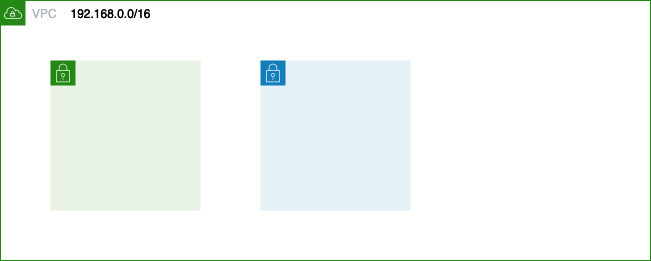
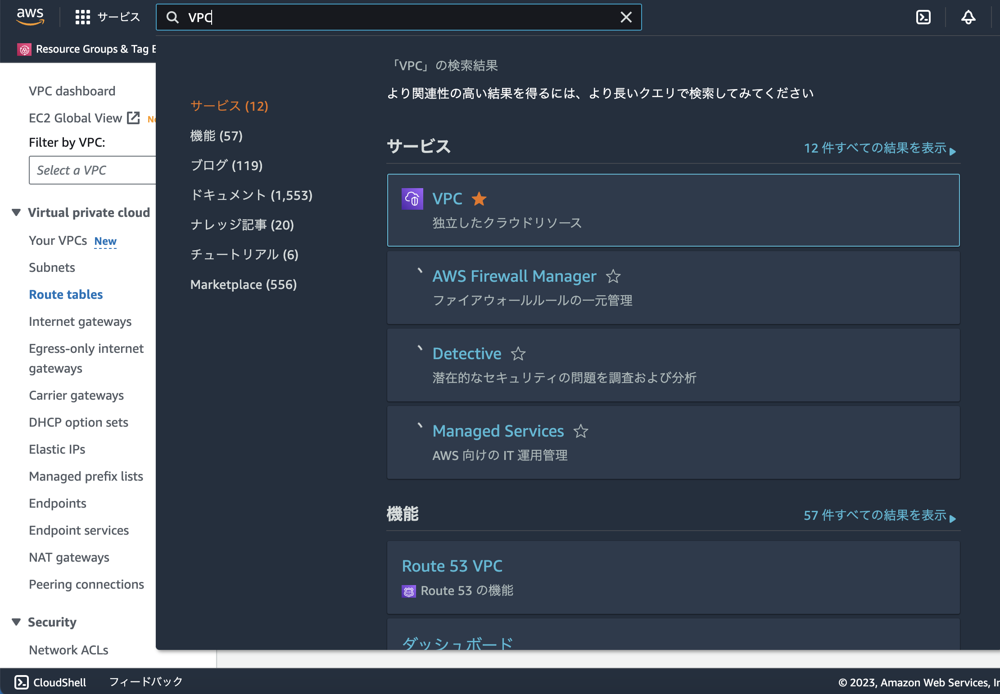
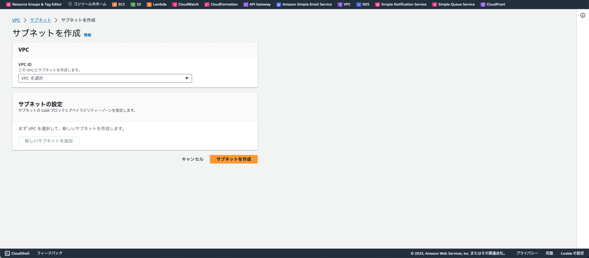
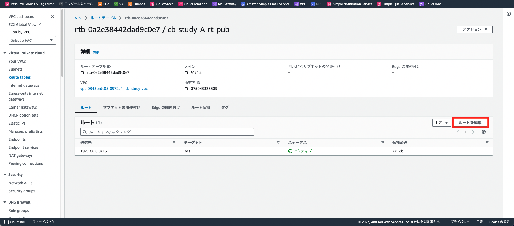
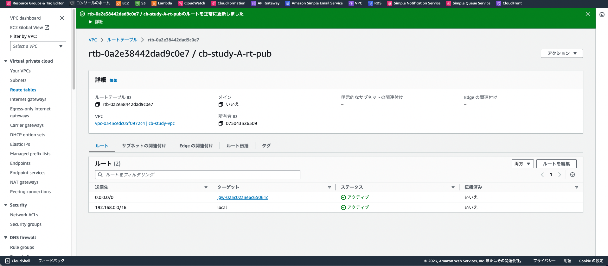
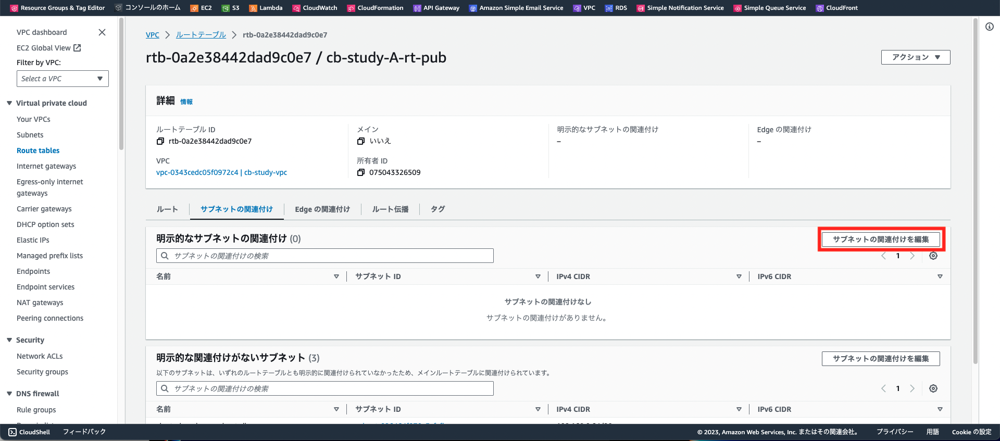
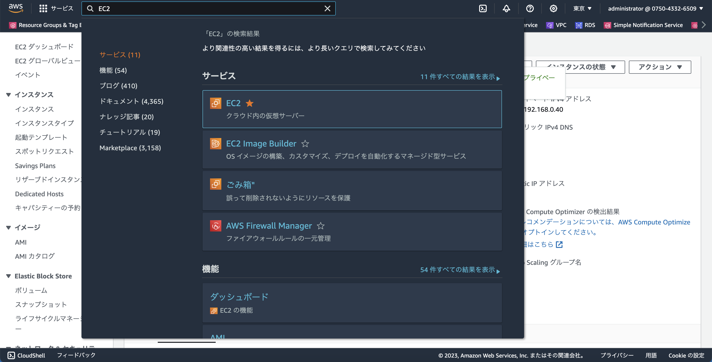
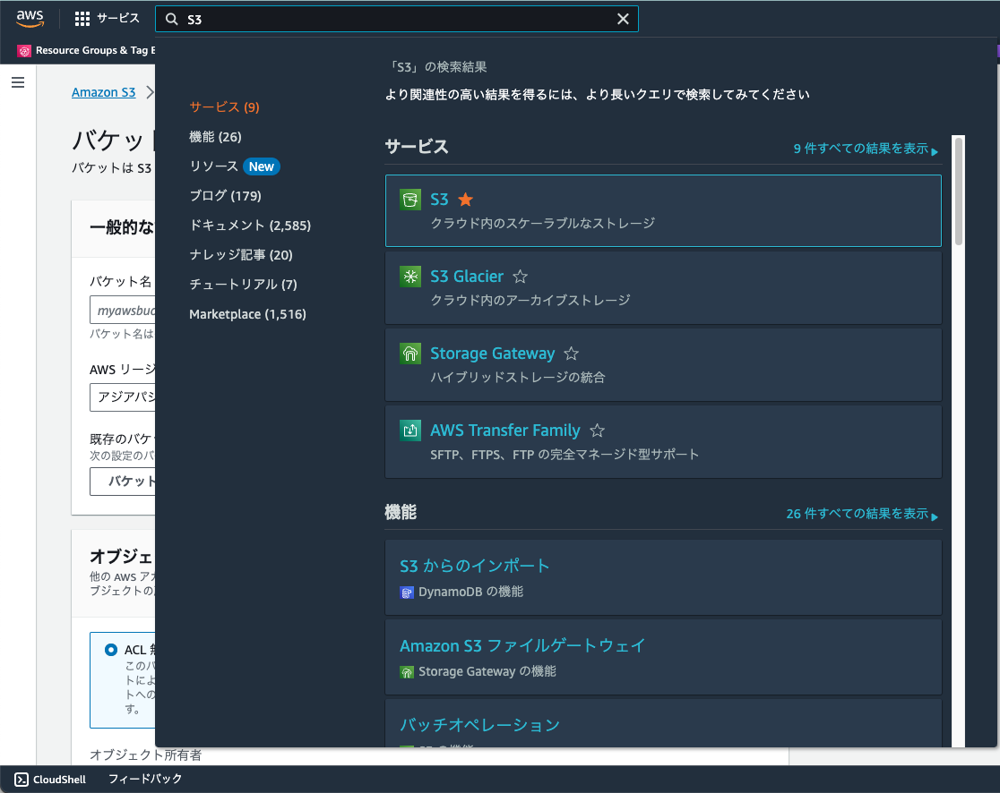

# WebAPI環境構築

## 基本ネットワーク構築
以下のように、パブリックサブネット・プライベートサブネットを一つずつ作成していきます。


※こちらを参考に作成するサブネットのIPアドレスを設定してください

### サブネット作成手順
1. 検索窓に「VPC」と入力、検索結果の「VPC」を選択してVPCダッシュボードを表示

1. 左ペインから「Subnets」を選択
1. 右上の「サブネットを作成」ボタンをクリック
1. [AWS勉強会 設定項目一覧](https://docs.google.com/spreadsheets/d/1X1n6WjJm4JfGjnZfjlxeLdW2Ue70t2Mjl9NUxywNPTY/edit?usp=sharing)の「サブネット一覧」シートを参照し、自分担当の以下を設定

    - publicサブネット
    - アプリケーションサブネット
1. 設定後、サブネットを作成ボタンをクリック


### ルーティング設定
1. 左ペインから「Route tables」を選択
1. publicサブネットのルーティング設定
    1. ルートテーブル画面から、右上の「ルートテーブル作成」ボタンをクリック
    1. [AWS勉強会 設定項目一覧](https://docs.google.com/spreadsheets/d/1X1n6WjJm4JfGjnZfjlxeLdW2Ue70t2Mjl9NUxywNPTY/edit?usp=sharing)の「ルートテーブル一覧」シートを参照し、自分担当のpublicルートテーブルを設定
    
    1. 設定項目の入力が完了したら、「ルートテーブルを作成」ボタンをクリックし、正常作成を確認
    
    1. ルートテーブル詳細画面 > ルートタブから、ルートを編集をクリック
    
        1. [AWS勉強会 設定項目一覧](https://docs.google.com/spreadsheets/d/1X1n6WjJm4JfGjnZfjlxeLdW2Ue70t2Mjl9NUxywNPTY/edit?usp=sharing)の「ルート一覧」シートを参照し、publicルートテーブルのルート一覧を設定する
        1. 変更を保存をクリックし、正常保存を確認する
        
    1. ルートテーブル詳細画面 > サブネットの関連付けタブから、サブネットの関連付けを編集をクリック
    
        1. [AWS勉強会 設定項目一覧](https://docs.google.com/spreadsheets/d/1X1n6WjJm4JfGjnZfjlxeLdW2Ue70t2Mjl9NUxywNPTY/edit?usp=sharing)の「ルートテーブル一覧」シートの関連付けサブネットを参照し、設定する
        1. 変更を保存をクリックし、正常保存を確認する
        
1. アプリケーションサブネットのルーティング設定
    1. 「publicサブネットのルーティング設定」手順を、アプリケーションルートテーブルに読み替えて設定する


## Webサーバの立ち上げ

### ALBの作成


## アプリケーションサーバの立ち上げ

<!-- アプリケーションサーバが立ち上がった際のイメージ説明 -->

### EC2の作成
1. 検索窓に「EC2」と入力、検索結果の「EC2」を選択してVPCダッシュボードを表示

1. 左ペインから「インスタンス」を選択
1. 右上の「インスタンスを起動」ボタンをクリック
1. インスタンスを起動画面
    1. [AWS勉強会 設定項目一覧](https://docs.google.com/spreadsheets/d/1X1n6WjJm4JfGjnZfjlxeLdW2Ue70t2Mjl9NUxywNPTY/edit?usp=sharing)の「EC2インスタンス一覧」シートを参照し、自分担当のリソース名で設定
    
    1. 設定項目の入力が完了したら、「インスタンスを起動」ボタンをクリックし、正常起動を確認

### Auto Scaling

#### 概要
Amazon EC2 Auto Scaling は、アプリケーションの負荷を処理するために適切な数の Amazon EC2 インスタンスを利用できるようにします。<br>
Auto Scaling グループと呼ばれる EC2 インスタンスの集合を作成します。<br>
Auto Scaling グループ内でインスタンスの最小数・最大数を定義することができ、アプリケーションに対するリクエストの増減に応じて、最小数〜最大数の範囲でインスタンスの数が増減します。<br>
また、希望するキャパシティーを指定した場合、Amazon EC2 Auto Scaling によって、グループのインスタンス数はこの数に設定されます。

例えば、次の Auto Scaling グループで、インスタンス数の最小サイズが 1、希望するキャパシティが 2、最大サイズが 4 であるとします。<br>
この図の場合、最初は 2台 で起動しますが、スケーリングポリシーと負荷状況によって 1台 〜 4台 の間の台数で、柔軟に変化します。


#### メリット
1. 耐障害性の向上。インスタンスの異常を検出し、インスタンスを削除して、その代わりに新しいインスタンスを起動することができます。
1. 複数のアベイラビリティーゾーン (AZ) を使用するように設定することもできます。たとえば、何かの障害により 1 つのアベイラビリティーゾーン (AZ) が利用できない場合は、別のアベイラビリティーゾーン (AZ) でインスタンスを起動します。
1. 可用性の向上。スケーリングポリシーにしたがって、トラフィックを処理するための適切な EC2 インスタンスの起動台数を調整します。
1. コスト管理の強化。必要に応じて動的に処理能力を増減でき、稼働した EC2 インスタンスのみの料金を支払うため、必要なときにインスタンスを起動し、不要な場合は削除することで費用を節約することができます。

#### 注意事項
1. Auto Scalingはアクセス増加検知後にAMIからEC2を作成する特性から、急なアクセス増加（スパイク）に対応することができません。[急なアクセスに耐えうるサービス](https://d1.awsstatic.com/events/jp/2020/innovate/pdf/S-19_AWSInnovate_Online_Conference_2020_Spring_Spiky_Serverless_App.pdf)
1. 起動中のEC2に変更を行った場合、AMIにも変更を適用します。事前に指定したAMIで起動するため、適用しなければAuto Scalingで起動したEC2インスタンスは古い状態で起動されます。
1. セッション情報などのリクエストに関連する情報は、他インスタンスでも利用する可能性があるため、EBSなどのインスタンスに依存しているディスクに保存するのではなく、DynamoDBなどの他のサービスを活用します。

#### 起動テンプレートの作成
Auto Scaling グループ内でインスタンス数の増加を図る際の起動テンプレートを作成します。


#### Auto Scaling Groupの作成


### DB接続


## S3の作成

### S3バケットの作成
1. 検索窓に「VPC」と入力、検索結果の「VPC」を選択してVPCダッシュボードを表示

1. 左ペインから「バケット」を選択
1. 「バケットを作成」ボタンをクリック
1. [AWS勉強会 設定項目一覧](https://docs.google.com/spreadsheets/d/1X1n6WjJm4JfGjnZfjlxeLdW2Ue70t2Mjl9NUxywNPTY/edit?usp=sharing)の「S3バケット一覧」シートを参照し、自分担当分を設定
1. 設定後、「バケットを作成」ボタンをクリック
1. バケットポリシーの設定
    1. バケット一覧画面から、作成したバケットをクリックしてバケット詳細画面を表示する
    1. アクセス許可タブをクリックする
    
    1. バケットポリシーセクションから編集ボタンをクリックし、バケットポリシー編集画面を表示する
    1. 以下バケットポリシーを貼り付ける<br>
    ※(バケット名)に作成したバケット名を設定
    ```
    {
        "Version": "2012-10-17",
        "Statement": [
            {
            "Effect": "Allow",
            "Principal": "*",
            "Action": [
                "s3:GetObject"
            ],
            "Resource": "arn:aws:s3:::(バケット名)/food_memo/*"
            }
        ]
    }
    ```
    


## 動作確認
